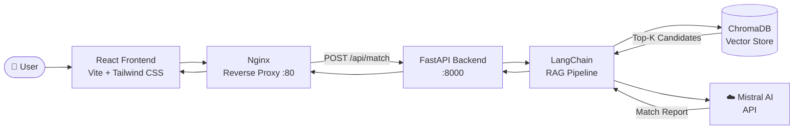

# Staffinc AI Matchmaker MVP


> **An AI-powered talent matching engine for the Staffinc recruitment platform — reducing candidate submission waste and improving client interview conversion rates.**

---

## The Business Problem

Staffinc operates at the intersection of talent supply and enterprise demand. One of the most significant operational challenges in the recruitment industry is **low interview-to-offer conversion rates**, driven by a fundamental mismatch:

- Traditional keyword-based filtering misses candidates with strong **soft skills and cultural alignment**.
- Account managers spend hours manually sifting through candidate pools to build shortlists.
- Clients receive profiles that meet the job description on paper, but fail in practice.

**The result:** wasted screening cycles, damaged client trust, and lower placement success rates.

## The AI Solution

The Staffinc AI Matchmaker addresses this by going beyond keyword matching. Using **semantic search and generative reasoning**, the tool:

1. Embeds every candidate's full profile (skills, experience, values, work style) into a high-dimensional vector space.
2. Translates a client's natural-language requirement into the same vector space.
3. Retrieves the most semantically similar candidates — those who match on **context, not just keywords**.
4. Uses a large language model to generate a **structured, human-readable match report** explaining *why* each candidate fits.

This shifts candidate selection from reactive filtering to proactive, intelligence-driven recommendation.

---

## Technical Architecture

The system is built on a **Retrieval-Augmented Generation (RAG)** pipeline:

| Layer | Technology | Role |
|---|---|---|
| Embedding & Retrieval | ChromaDB | Stores candidate vector embeddings and performs semantic similarity search |
| Reasoning & Generation | Mistral AI (via API) | Synthesizes retrieved context into a coherent, structured match report |
| Orchestration | LangChain | Chains the retrieval and generation steps into a single, auditable pipeline |
| API | FastAPI | Exposes REST endpoints consumed by the frontend |
| Serving | Nginx | Reverse proxy routing `/api/` to the backend; serves the compiled React SPA |

### Architecture Diagram



---

## Tech Stack

| Technology | Justification |
|---|---|
| **React 18 + Vite** | Fast HMR during development; optimised production builds with tree-shaking and code splitting |
| **Tailwind CSS** | Utility-first styling with zero runtime overhead; consistent brand-aligned design system |
| **FastAPI** | Async Python framework with automatic OpenAPI docs; ideal for ML workloads requiring low-latency I/O |
| **LangChain** | Modular abstraction over LLM and vector store integrations; simplifies RAG chain construction and future model swaps |
| **ChromaDB** | Lightweight, embedded vector database — no external infrastructure required for the MVP; persistent via volume mount |
| **Mistral AI** | State-of-the-art open-weight LLM with strong reasoning and instruction-following; cost-efficient at scale |
| **Docker Compose** | Reproducible multi-container orchestration; single command to launch the full stack in any environment |

---

## Key Features

### 🔍 Semantic Candidate Search
Candidate profiles are embedded as dense vectors, enabling searches that capture *meaning* — not just overlapping keywords. A query for "empathetic team leader" will surface candidates who demonstrate those qualities, regardless of exact phrasing in their profiles.

### 📄 Automated Match Reports
For each query, the system generates a structured, client-ready narrative explaining candidate suitability, ranked fit, and key differentiators. Reports are rendered as formatted Markdown in the UI.

### 🏷️ Brand-Aligned UI
The frontend is built to Staffinc's corporate identity — yellow accent system, clean enterprise SaaS layout, and the official Staffinc logo — ensuring the tool feels like a native product, not a prototype.

### ⚡ One-Command Deployment
The entire stack — frontend, backend, and reverse proxy — runs with a single `docker compose up --build` command, enabling rapid deployment on any Docker-capable host or cloud instance.

---

## Project Structure

```
.
├── backend/
│   ├── main.py              # FastAPI application & API routes
│   ├── ai_service.py        # LangChain RAG pipeline (ChromaDB + Mistral)
│   ├── requirements.txt
│   ├── Dockerfile
│   └── data/
│       └── candidates.json  # Candidate profile data source
├── frontend/
│   ├── src/
│   │   ├── App.jsx          # Main UI component
│   │   └── assets/          # Brand assets (logo)
│   ├── nginx.conf           # Nginx SPA + reverse proxy config
│   ├── Dockerfile           # Multi-stage Node build → Nginx serve
│   └── package.json
├── docker-compose.yml
└── README.md
```

---

## Local Setup

### Prerequisites

- [Docker Desktop](https://www.docker.com/products/docker-desktop/) installed and running
- A valid **Mistral AI API key** — obtain one at [console.mistral.ai](https://console.mistral.ai)

### Configuration

Create a `.env` file inside the `backend/` directory:

```env
MISTRAL_API_KEY=your_mistral_api_key_here
```

> This file is excluded from version control via `.gitignore`.

### Run the Stack

```bash
# Clone the repository
git clone <repository-url>
cd Staffinc_AI-Project-Manager

# Build and start all services
docker compose up --build
```

The application will be available at **[http://localhost](http://localhost)**.

### Usage

1. Open [http://localhost](http://localhost) in your browser.
2. Click **Initialize Database** to embed candidate profiles into ChromaDB.
3. Enter a client requirement in plain English (e.g., *"We need a senior data engineer with strong communication skills for a fast-paced fintech startup"*).
4. Click **Find Best Match** to generate a semantic match report.

### Development (without Docker)

**Backend:**
```bash
cd backend
python -m venv venv && source venv/bin/activate  # Windows: venv\Scripts\activate
pip install -r requirements.txt
uvicorn main:app --reload --port 8000
```

**Frontend:**
```bash
cd frontend
npm install
npm run dev
```

---

## Deployment

The containerised architecture is cloud-agnostic. Recommended deployment targets:

- **AWS ECS / App Runner** — deploy the `docker-compose.yml` services as ECS tasks behind an Application Load Balancer
- **AWS EC2** — install Docker, clone the repo, and run `docker compose up -d`
- **Any VPS** — DigitalOcean, Hetzner, Linode — same single-command deployment

---

## License

Internal tool — proprietary to **Staffinc**. Not licensed for external distribution.

---

<div align="center">
  <sub>Built with ❤️ by Seno Aji</sub>
</div>
